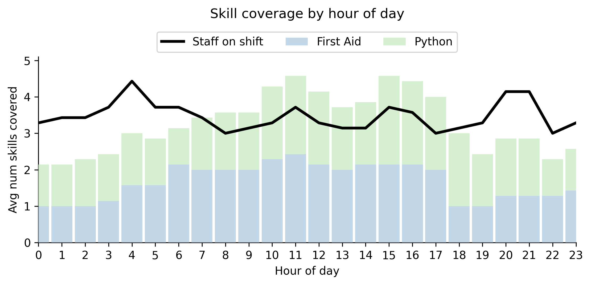
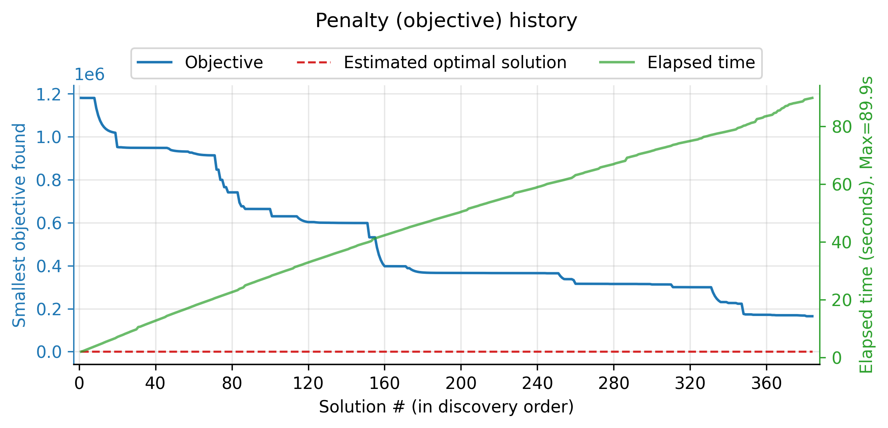
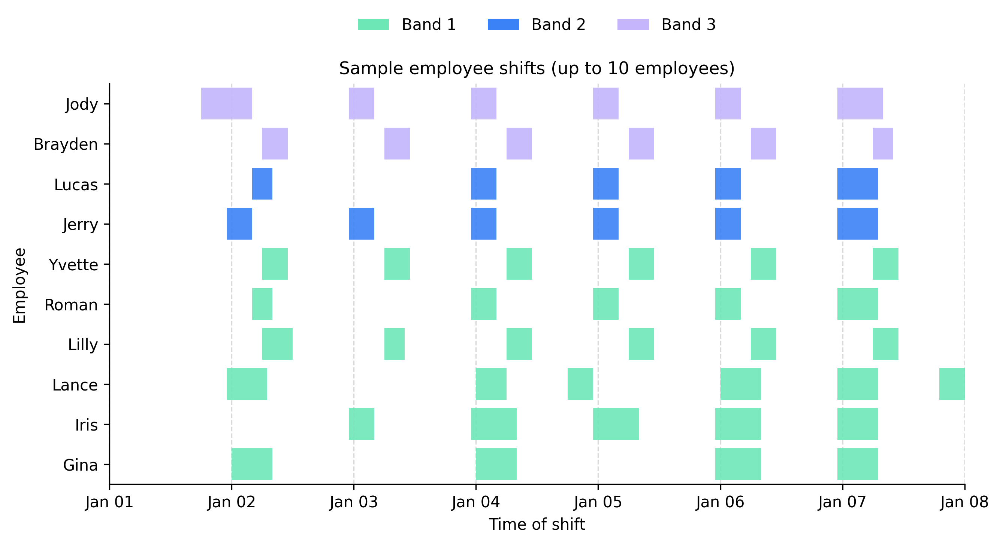

# src/ directory

Everything directly under `src/` (i.e. not in `src/rostering/`) is intended as example code only.

Key module:

- `example.py` – CLI showcasing three scenarios:
  1. Synthetic staff generation via `Config`.
  2. Inline staff definitions for quick experiments.
  3. Loading real staff from `example_staff.json` and running with a lightweight rule template.
  Run `python3 -m src.example --option 3` to reproduce the default demo.

Example staff data JSON file:
- `example_staff.json` – 50-person roster feeding option 3. Staff can have “Python”, “First Aid”, and/or “Senior” skills, making the file a template for your own data.

Example outputs:
- Hour-of-day coverage bars: 
  

- Solver progress plot: 
  

- Sample employee assigned shift Gantt chart:  
  

Running any example writes the full text report to `outputs/report.pdf` and saves fresh figures beside it; these snapshots are just quick references.

The full library lives in `src/rostering/` (config, rules, reporting, solver).
